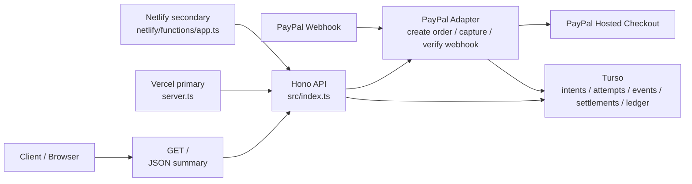
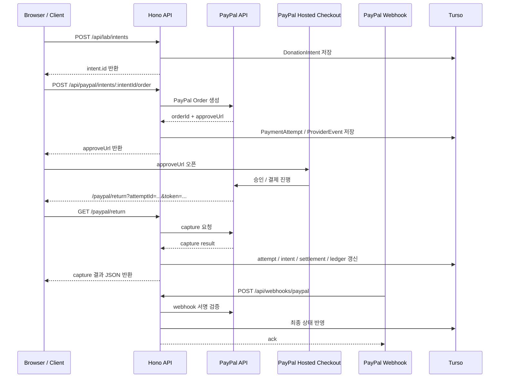

# pay-to-minwoo

`pay-to-minwoo`는 도네이션 랜딩페이지가 아니라 `결제 코어(payment core)`를 학습하고 검증하기 위한 `API-first backend`다.

실제 관심사는 UI가 아니라 아래 도메인들이다.

- `DonationIntent`: 누가 얼마를 어떤 통화로 보내려는지
- `PaymentAttempt`: 실제 결제사 시도 1회
- `ProviderEvent`: PayPal webhook 같은 외부 사실
- `AuditLog`: 상태 전이와 외부 이벤트 기록
- `IdempotencyRecord`: 중복 요청 방지
- `SettlementRecord`: 결제 성공 후 정산 대기/지급 상태
- `LedgerEntry`: gross, fee, payout 같은 장부 변화

## 현재 상태

- 운영 기준 호스트: `Vercel primary`
- 보조 호스트: `Netlify secondary`
- 저장소: `Turso`
- 실제 provider adapter: `PayPal sandbox`
- UI: 없음
- 루트(`/`): 브라우저 `Accept-Language` 기준 `ko/en` JSON summary 반환

즉 이 프로젝트는 `결제 페이지`가 아니라 `결제 서버`다.

## 프로젝트 구조



### 코드 기준 역할 분리

- `src/index.ts`
  - 공유 Hono 앱
  - 모든 도메인 라우트와 PayPal adapter 호출이 여기 있다
- `api/router.ts`
  - `Vercel`용 wrapper 예비 엔트리
  - 현재 배포는 Hono가 shared app을 직접 올리고, 이 파일은 wrapper 경로가 필요할 때 쓴다
- `netlify/functions/app.ts`
  - `Netlify secondary` wrapper
- `src/lib/payment-lab-service.ts`
  - intent, attempt, settlement, ledger 상태 전이
- `src/lib/paypal.ts`
  - PayPal OAuth, order 생성, capture, webhook 검증
- `src/lib/repositories/*`
  - memory / Turso 저장소 경계

## 결제 파이프라인



## 왜 실제 연결이 없어 보였나

이전 버전은 `PayPal 주문 생성`, `capture`, `webhook 검증`까지는 실제였지만,
그 위에 임시 HTML 화면이 덮여 있어서 구조가 흐려져 있었다.

지금 기준으로 실제 PayPal 연결 지점은 아래 3개다.

- `POST /api/paypal/intents/:intentId/order`
- `POST /api/paypal/attempts/:attemptId/capture`
- `POST /api/webhooks/paypal`

즉 `버튼 UI` 가 없었을 뿐, provider adapter는 이미 붙어 있다.

## 로컬 실행

Vercel 기준으로 로컬 실행한다.

```bash
cp .env.example .env.local
npm install
npm run db:init:turso
npm run typecheck
npm test
./node_modules/.bin/vercel dev
```

기본 로컬 URL은 `http://127.0.0.1:3000` 기준이다.

## 환경변수

`.env.local` 기준:

- `APP_NAME`
- `PAYMENT_MODE`
- `PAYMENT_STORAGE=turso`
- `PUBLIC_BASE_URL`
- `TURSO_DATABASE_URL`
- `TURSO_AUTH_TOKEN`
- `PAYPAL_ENV=sandbox`
- `PAYPAL_CLIENT_ID`
- `PAYPAL_CLIENT_SECRET`
- `PAYPAL_WEBHOOK_ID`

## 실제 결제 프로세스 예시

### 1. intent 생성

```bash
curl -X POST http://127.0.0.1:3000/api/lab/intents \
  -H 'content-type: application/json' \
  -d '{
    "amount": 500,
    "currency": "USD",
    "customerEmail": "sandbox@example.com",
    "customerName": "Sandbox Donor",
    "itemName": "Support Minwoo",
    "region": "international"
  }'
```

응답에서 `intent.id` 를 받는다.

### 2. PayPal 주문 생성

```bash
curl -X POST http://127.0.0.1:3000/api/paypal/intents/<INTENT_ID>/order \
  -H 'content-type: application/json' \
  -d '{}'
```

응답에서 아래 값을 본다.

- `attempt.id`
- `paypal.orderId`
- `paypal.approveUrl`

### 3. approveUrl 열기

브라우저에서 `paypal.approveUrl` 을 연다.
이 단계는 우리 서버가 아니라 `PayPal hosted checkout` 이 처리한다.

### 4. PayPal return

승인되면 PayPal 이 아래 URL 로 되돌린다.

```text
/paypal/return?attemptId=<ATTEMPT_ID>&token=<PAYPAL_ORDER_ID>
```

이 라우트는 HTML 없이 바로 `capture` 결과 JSON을 반환한다.

### 5. webhook 반영

PayPal webhook 이 `/api/webhooks/paypal` 로 들어오면,
서버는 PayPal 서명 검증 후 `attempt`, `intent`, `settlement`, `ledger` 상태를 반영한다.

### 6. 상태 확인

```bash
curl http://127.0.0.1:3000/api/lab/attempts/<ATTEMPT_ID>
curl http://127.0.0.1:3000/api/lab/snapshot
```

## 주요 엔드포인트

- `GET /`
- `GET /api/health`
- `GET /api/lab/snapshot`
- `POST /api/lab/reset`
- `POST /api/lab/intents`
- `GET /api/lab/intents/:intentId`
- `GET /api/lab/attempts/:attemptId`
- `GET /api/lab/settlements/:settlementId`
- `POST /api/lab/settlements/:settlementId/actions/payout`
- `POST /api/lab/attempts/:attemptId/actions/:action`
- `POST /api/paypal/intents/:intentId/order`
- `POST /api/paypal/attempts/:attemptId/capture`
- `GET /paypal/return`
- `GET /paypal/cancel`
- `POST /api/webhooks/mock`
- `POST /api/webhooks/paypal`
