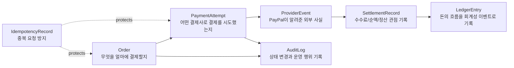
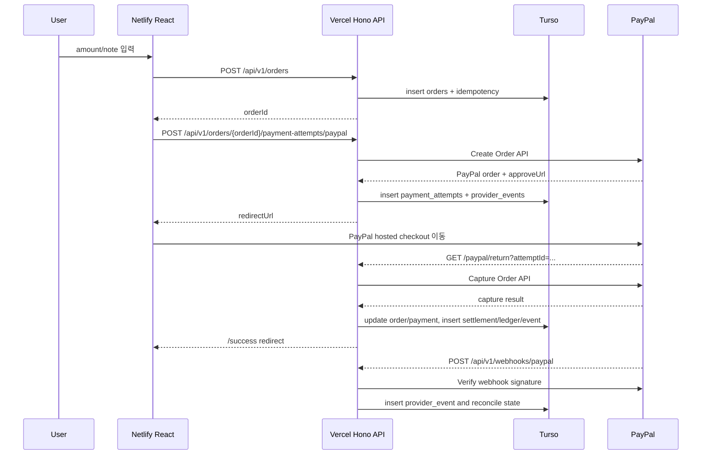

# pay-to-minwoo

`pay-to-minwoo`는 단순 mock 도네이션 페이지가 아니라 실제 PayPal hosted checkout을 붙인 API-first 결제 코어다.

기준은 아래처럼 고정한다.

- mock 모드 없음
- runtime backend는 `src/`의 Node.js + Hono + Vercel 하나만 사용
- Spring backend 제거
- frontend는 Netlify React 앱
- DB는 Turso
- 결제사는 현재 PayPal만 실제 연결, 다른 결제사는 같은 provider adapter 구조로 확장
- 현재 PayPal Orders API 기준 결제 통화는 `USD`를 사용한다. `KRW`는 PayPal Orders API에서 거부된다.

## 배포 주소

- Frontend: [https://pay-to-minwoo-web.netlify.app](https://pay-to-minwoo-web.netlify.app)
- Backend: [https://pay-to-minwoo.vercel.app](https://pay-to-minwoo.vercel.app)
- Admin: [https://pay-to-minwoo-web.netlify.app/admin](https://pay-to-minwoo-web.netlify.app/admin)

## 도메인 기준



## 테이블

- `orders`: 주문/도네이션 의도. 금액, 통화, note, 상태, 현재 payment attempt를 가진다.
- `payment_attempts`: PayPal order/capture와 연결되는 실제 결제 시도.
- `provider_events`: PayPal API 응답과 webhook 원본 이벤트 저장.
- `settlement_records`: gross/fee/net, payout reference, 정산 상태 저장.
- `ledger_entries`: 결제금액 credit, 수수료 debit 같은 돈의 흐름 기록.
- `audit_logs`: 상태 변경 이력.
- `idempotency_records`: 버튼 중복 클릭/네트워크 재시도 방지.

## 실제 PayPal 파이프라인



## API

### Public

- `GET /`
- `GET /api/v1/health`
- `POST /api/v1/orders`
- `POST /api/v1/orders/:orderId/payment-attempts/paypal`
- `GET /api/v1/orders/:orderId`
- `GET /api/v1/payment-attempts/:attemptId`
- `GET /paypal/return`
- `GET /paypal/cancel`
- `POST /api/v1/webhooks/paypal`

### Admin

`X-Admin-Password` 헤더가 필요하다.

- `GET /api/v1/admin/dashboard`
- `GET /api/v1/admin/tables`
- `GET /api/v1/admin/tables/:tableName/rows?page=1&pageSize=20`
- `PATCH /api/v1/admin/tables/:tableName/rows/:rowId`

## 환경 변수

### Frontend

```env
VITE_API_BASE_URL=https://pay-to-minwoo.vercel.app
```

### Backend

```env
FRONTEND_BASE_URL=https://pay-to-minwoo-web.netlify.app
PUBLIC_BASE_URL=https://pay-to-minwoo.vercel.app
CORS_ALLOWED_ORIGINS=https://pay-to-minwoo-web.netlify.app
ADMIN_PASSWORD=321
TURSO_DATABASE_URL=...
TURSO_AUTH_TOKEN=...
PAYPAL_ENV=sandbox # or live
PAYPAL_CLIENT_ID=...
PAYPAL_CLIENT_SECRET=...
PAYPAL_WEBHOOK_ID=...
```

`PAYPAL_ENV=sandbox`도 mock이 아니다. PayPal sandbox API를 실제로 호출하는 provider integration 환경이다.

주의: 한국어 UI도 현재는 PayPal provider가 지원하는 `USD`로 주문을 만든다. 원화 표시/환산을 붙이려면 `Order`의 표시 통화와 `PaymentAttempt`의 provider 통화를 분리해야 한다.

## 로컬 실행

```bash
cp .env.example .env.local
npm install
npm run dev:backend
```

```bash
cd frontend
cp .env.example .env.local
npm install
npm run dev
```

## 검증

```bash
npm --prefix frontend run build
npx vercel build --prod
```

PayPal sandbox에서 확인할 순서:

1. `POST /api/v1/orders`
2. `POST /api/v1/orders/:orderId/payment-attempts/paypal`
3. 응답의 `redirectUrl`로 이동
4. PayPal 승인
5. `/paypal/return`에서 capture
6. `/api/v1/webhooks/paypal` 이벤트 수신
7. admin에서 `orders`, `payment_attempts`, `provider_events`, `settlement_records`, `ledger_entries` 확인
