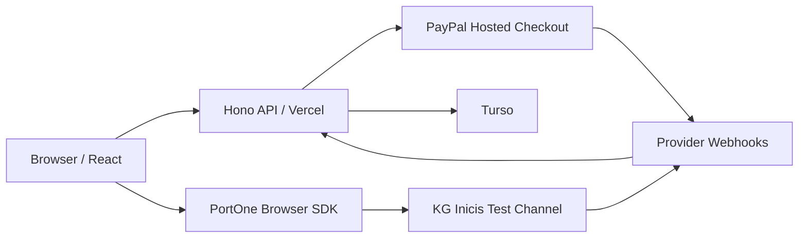
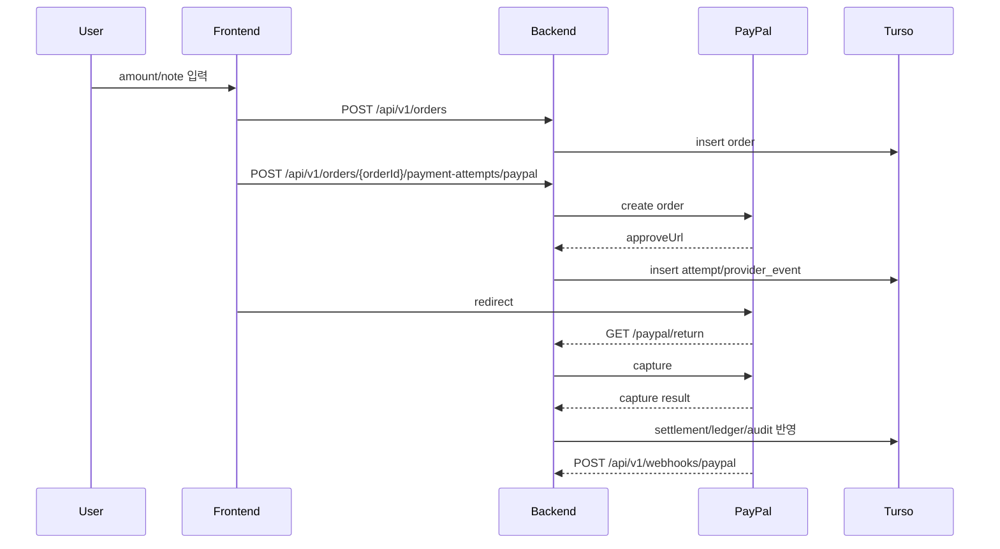
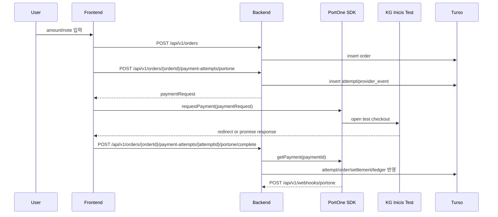

# pay-to-minwoo

`pay-to-minwoo`는 도네이션 랜딩 페이지가 아니라 `결제 코어 실험용 프로젝트`다.

기준은 아래처럼 둔다.

- backend: `Node.js + Hono + Vercel`
- frontend: `React + Vite + Netlify`
- database: `Turso`
- 해외 결제: `PayPal`
- 국내 테스트 결제: `PortOne + KG이니시스 test channel`
- `main/prod`에서는 PayPal 중심
- `dev/preview`에서는 PortOne 국내 테스트 결제 노출 가능

## 배포 주소

- Frontend: [https://pay-to-minwoo-web.netlify.app](https://pay-to-minwoo-web.netlify.app)
- Backend: [https://pay-to-minwoo.vercel.app](https://pay-to-minwoo.vercel.app)
- Admin: [https://pay-to-minwoo-web.netlify.app/admin](https://pay-to-minwoo-web.netlify.app/admin)

## 구조



## 도메인 모델

- `Order`: 주문/도네이션 의도
- `PaymentAttempt`: 어떤 provider로 어떤 방식으로 결제 시도했는지
- `ProviderEvent`: PayPal/PortOne/webhook/sync 결과
- `SettlementRecord`: gross/fee/net 관점의 정산 기록
- `LedgerEntry`: credit/debit 원장 이벤트
- `AuditLog`: 상태 변경 이력
- `IdempotencyRecord`: 중복 요청 방지

## 테이블

- `orders`
- `payment_attempts`
- `provider_events`
- `settlement_records`
- `ledger_entries`
- `audit_logs`
- `idempotency_records`

## 파이프라인

### 해외: PayPal



### 국내 테스트: PortOne + KG이니시스



## API

### Public

- `GET /`
- `GET /api/v1/health`
- `POST /api/v1/orders`
- `POST /api/v1/orders/:orderId/payment-attempts/paypal`
- `POST /api/v1/orders/:orderId/payment-attempts/portone`
- `POST /api/v1/orders/:orderId/payment-attempts/:attemptId/portone/complete`
- `GET /api/v1/orders/:orderId`
- `GET /api/v1/payment-attempts/:attemptId`
- `GET /paypal/return`
- `GET /paypal/cancel`
- `POST /api/v1/webhooks/paypal`
- `POST /api/v1/webhooks/portone`

### Admin

`X-Admin-Password` 헤더 필요.

- `GET /api/v1/admin/dashboard`
- `GET /api/v1/admin/tables`
- `GET /api/v1/admin/tables/:tableName/rows?page=1&pageSize=20`
- `PATCH /api/v1/admin/tables/:tableName/rows/:rowId`

## 환경 변수

### Backend

```env
APP_STAGE=dev
FRONTEND_BASE_URL=http://localhost:5173
PUBLIC_BASE_URL=http://localhost:3000
CORS_ALLOWED_ORIGINS=http://localhost:5173,http://127.0.0.1:5173
ADMIN_PASSWORD=321
TURSO_DATABASE_URL=...
TURSO_AUTH_TOKEN=...
PAYPAL_ENV=sandbox
PAYPAL_CLIENT_ID=...
PAYPAL_CLIENT_SECRET=...
PAYPAL_WEBHOOK_ID=...
ENABLE_PORTONE_DOMESTIC_TEST=true
PORTONE_STORE_ID=...
PORTONE_CHANNEL_KEY=...
PORTONE_API_SECRET=...
PORTONE_WEBHOOK_SECRET=...
```

### Frontend

```env
VITE_API_BASE_URL=http://localhost:3000
VITE_APP_STAGE=dev
VITE_ENABLE_DOMESTIC_TEST=true
```

## 환경 정책

- `prod/main`
  - 해외 PayPal만 기본 노출
  - 국내 PortOne 테스트는 기본 비노출
- `dev/preview`
  - PayPal sandbox 가능
  - PortOne + KG이니시스 test 가능

## 로컬 실행

```bash
cp .env.example .env.local
npm install
npm run dev:backend
```

```bash
cd frontend
cp .env.example .env.local
npm install
npm run dev
```

## 검증

```bash
npm --prefix frontend run build
npx vercel build --prod
```

PortOne 테스트 확인 순서:

1. `POST /api/v1/orders`
2. `POST /api/v1/orders/:orderId/payment-attempts/portone`
3. `requestPayment(paymentRequest)`
4. `POST /api/v1/orders/:orderId/payment-attempts/:attemptId/portone/complete`
5. `POST /api/v1/webhooks/portone`
6. admin에서 `orders`, `payment_attempts`, `provider_events`, `settlement_records`, `ledger_entries` 확인
